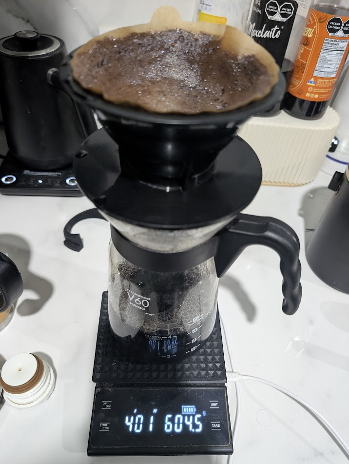

# ☕ V60: Mezcla Especial Chiapas - Bella Vista

## ☕ Ficha técnica
- **Método**: Hario V60 (02)
- **Ratio**: 1:15
- **Café**: 40g (Caracolillo, Árabe, Bourbon)
- **Agua**: 600ml
- **Molienda**: Media / **Nivel 52** en DF54
- **Temperatura**: 90°C

## 🛠️ Equipamiento adicional
- [x] Filtro Hario (Enjuagado)
- [x] Báscula con cronómetro
- [x] Tetera cuello de cisne

## 📝 Procedimiento
1. **Bloom**: 80ml / 45 segundos.
2. **Primer Vertido**: Hasta 350ml (Flujo constante circular). Esperar **1:15**.
3. **Segundo Vertido**: Al minuto 2:00, completar hasta 600ml. Esperar **2:00**.
4. **Finalización**: Filtrado total en aproximadamente 4:01.

## 📸 Bitácora de Imágenes

## 💡 Notas y consejos
- *El tiempo es perfecto para 4 tazas. Si el sabor es muy intenso, puedes subir a **Nivel 54** para buscar notas más brillantes.*
- *La cama de café plana confirma que la técnica de vertido fue estable.*
