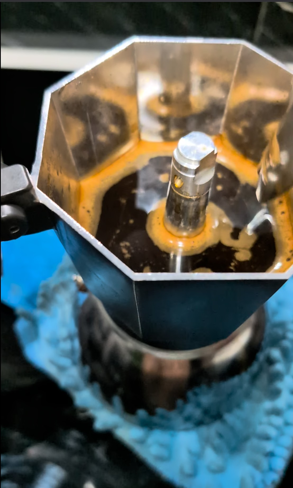

# Brikka: Huupa Descafeinado Natural (v1.0)

**Estado:** ✅ EXITO (Validado el 07-03-2026)
**Resultado:** Extracción con cuerpo denso, crema elástica y flujo laminar sin turbulencia.

---

## ☕ Ficha técnica
- **Método**: Brikka Induction (4 tazas)
- **Ratio**: 1:5.3
- **Café**: 28g (Huupa - Tueste Medio Oscuro)
- **Agua**: 150ml (Precalentada)
- **Molienda**: Nivel 22 en DF54
- **Temperatura**: Agua precalentada (~75°C) para reducir tiempo en estufa

## 🛠️ Equipamiento adicional
- [x] Báscula (Precisión 0.1g)
- [x] Cronómetro (Para monitorear tiempo de subida)
- [x] Molino DF54 (Flat Burrs)
- [x] Trapo de cocina (Para cierre de base caliente)

## 📝 Procedimiento
1. **Preparación**: Calentar 150ml de agua por separado hasta los 75°C aproximadamente.
2. **Molienda**: Moler los 28g en nivel 22 de la DF54; usar RDT si el grano descafeinado genera mucha estática.
3. **Carga**: Verter el café en el filtro cónico y nivelar con ligeros golpes laterales sin compactar.
4. **Ensamble**: Verter el agua caliente en la base y cerrar con fuerza máxima usando un trapo para protegerse del calor.
5. **Extracción**: Colocar en inducción nivel 8. Al primer siseo y flujo de café, bajar inmediatamente a nivel 5.
6. **Corte**: Retirar de la placa en cuanto el flujo cubra el fondo y el siseo se vuelva constante.

## 📸 Bitácora de Imágenes

## 💡 Notas y consejos
- *Si notas el flujo inicial muy violento ("escupitajo"), subir a nivel 23 en la DF54 para reducir la resistencia inicial.*
- *Se sacrifica la crema pero se obtiene una mejor consistencia, suavidad y un gran café para preparar un latte o capuccino*