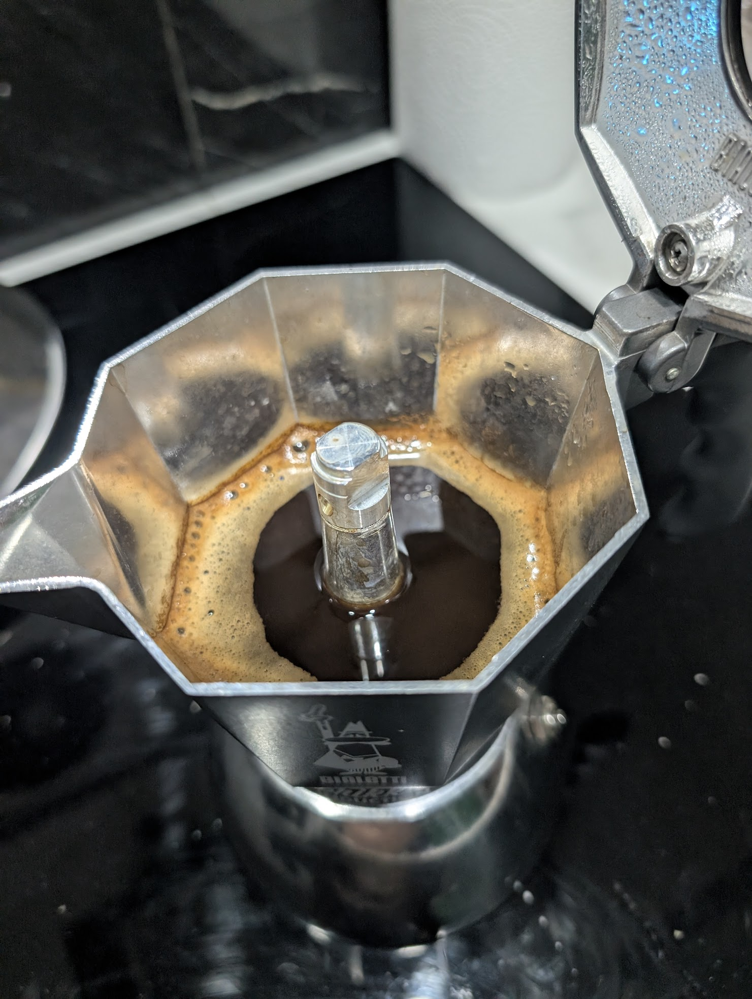

# ☕ Brikka: Arábico Daily (v2.2 - Validada)

**Estado:** ✅ EXITO (Validado el 08-03-2026)
**Resultado:** Extracción con cuerpo denso, crema elástica y flujo laminar sin turbulencia.

---

## ☕ Ficha técnica
- **Método**: Brikka Induction (4 tazas)
- **Ratio**: 1:5.3 (28g / 150ml)
- **Café**: 28g (Arábico con cafeína)
- **Agua**: 150ml (Precalentada a ~75°C)
- **Molienda**: **Nivel 17** en DF54
- **Temperatura**: Inicio con agua caliente para proteger el perfil dulce.

## 🛠️ Equipamiento adicional
- [x] Báscula (28g café / 150ml agua)
- [x] Molino DF54 (Ajuste micrométrico 17)
- [x] Trapo de cocina (Para cierre hermético en caliente)

## 📝 Procedimiento
1. **Molienda**: Nivel 17. La granulometría debe permitir un flujo constante desde el segundo 1 del disparo.
2. **Carga**: Llenar el filtro sin presionar; nivelar únicamente con golpeteo lateral.
3. **Extracción**: Inducción en Nivel 8.
4. **Corte**: Retirar inmediatamente al escuchar el siseo de aire para evitar que el calor del adaptador (si se usa) sobre-extraiga el remanente.

## 📸 Bitácora de Imágenes

## 💡 Notas y consejos