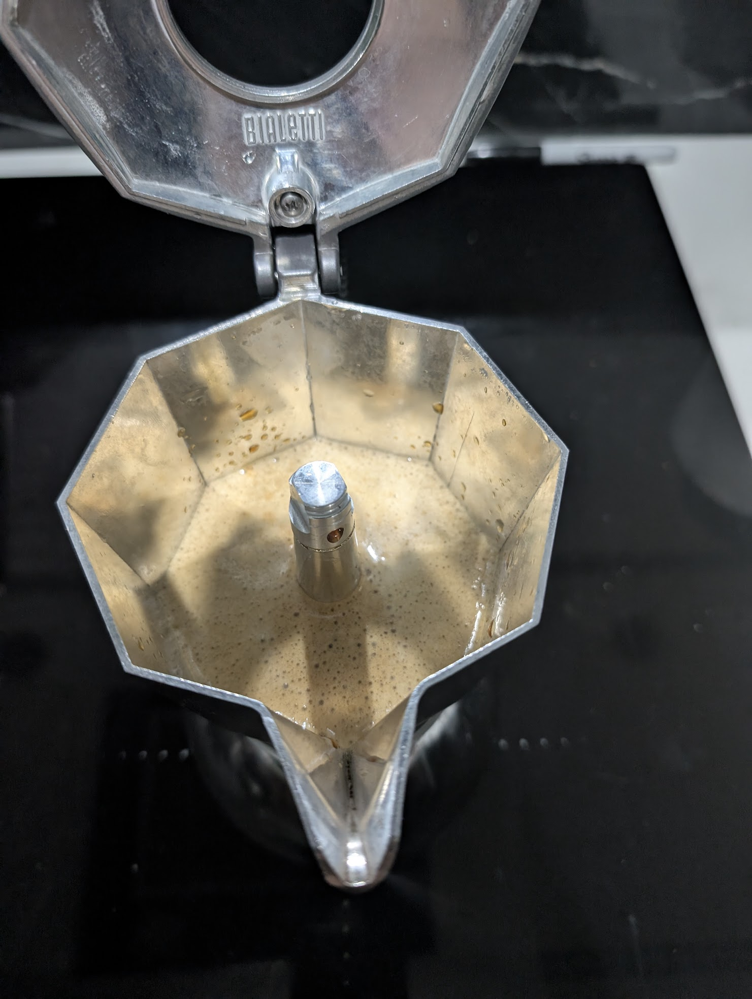

# ☕ Brikka Induction: Arábico Estándar (v2.1 - Validada)

**Estado:** ✅ EXITO (Validado el 08-03-2026)
**Resultado:** Extracción con cuerpo denso, crema elástica y flujo laminar sin turbulencia.

---

## ☕ Ficha técnica
- **Método**: Brikka Induction (4 tazas)
- **Ratio**: 1:5.3
- **Café**: 28g (Arábico Estándar - Tueste Medio/Oscuro)
- **Agua**: 150ml (Filtrada / Temp. ambiente)
- **Molienda**: Fina / **Nivel 18** en DF54
- **Temperatura**: Inicio con agua natural (fría) para permitir acumulación de presión de vapor.

## 🛠️ Equipamiento adicional
- [x] **Molino**: DF54 (Flat Burrs)
- [x] **Báscula**: Precisión 0.1g
- [x] **Contenedor**: Al vacío (para preservar frescura del grano intercalado)
- [x] **Accesorios**: Vaso dosificador con RDT y tazas pre-calentadas

## 📝 Procedimiento
1. **Gestión de Grano**: Al sacar del contenedor al vacío, aplicar RDT (una gota de agua) para mitigar la estática de los aceites del tueste oscuro en el vaso de la DF54.
2. **Molienda**: Ajustar a **Nivel 18**. Este grano permite bajar un punto más que el Geisha sin bloquear la válvula, generando una crema más densa.
3. **Carga y Nivelación**: Verter los 28g en el embudo. Dar golpes laterales hasta que el café quede plano al ras del borde. **No compactar**.
4. **Sello Hermético**: Limpiar meticulosamente el borde del embudo. Enroscar con fuerza máxima manual sujetando el cuerpo metálico.
5. **Extracción en Inducción**: 
    - Iniciar en **Nivel 8**.
    - Al primer siseo o "escupitajo" de café, bajar inmediatamente a **Nivel 5 o 6**.
6. **Corte y Servicio**: Retirar de la placa al primer cambio de sonido (burbujeo). Servir de inmediato a 45° en tazas previamente calentadas.

## 📸 Bitácora de Imágenes

---

## 📓 Notas de la Bitácora
* **Diferencia vs Geisha**: Este grano genera una crema mucho más estable y oscura debido a su perfil de tueste.