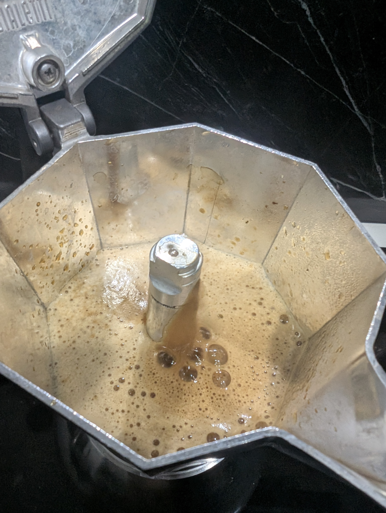

# ☕ Brikka: Baja Desert Decaf - Sierra Mixteca

## ☕ Ficha técnica
- **Método**: Brikka Induction (4 tazas)
- **Ratio**: ~1:5.8
- **Café**: **26g** (Baja Desert Descafeinado) ✅ *Dosis óptima para evitar desbordes por baja densidad*
- **Agua**: **150ml**
- **Molienda**: Fina / **Nivel 26** en DF54
- **Temperatura**: **Agua al tiempo** (Ambiente) ❄️

## 🛠️ Equipamiento adicional
- [x] Báscula con precisión 0.1g
- [x] Cronómetro
- [x] RDT (Indispensable: los decaf generan estática extrema)
- [x] Paño húmedo o base fría para choque térmico

## 📝 Procedimiento
1. **Molienda (RDT)**: Aplicar una gota de agua a los 26g antes de moler. El **Nivel 26** es vital para permitir que el agua pase a través de la gran cantidad de "finos" que genera este grano descafeinado al romperse.
2. **Carga**: Llenar la canasta. Verás que queda muy al ras debido al volumen del tueste medio-oscuro. Nivela con golpecitos laterales; **estrictamente prohibido compactar**.
3. **Llenado de Agua**: Verter los 150ml de agua fría/ambiente en la base. Usar agua fría ayuda a que la presión suba más lentamente, protegiendo las notas dulces de turrón y manzana.
4. **Extracción**: Colocar en inducción a **Nivel 7**. Mantener la tapa abierta para monitorear el flujo.
5. **Corte**: En cuanto la válvula libere la espuma color turrón y llene la parte superior, retirar inmediatamente y enfriar la base con agua fría para detener la extracción.

## 📸 Bitácora de Imágenes
- *Validación de Crema*: - Espuma elástica y persistente con molienda en nivel 26.
- *Validación de Color*: - Tono turrón claro, indicativo de una extracción balanceada.

## 💡 Notas y consejos
- *El **Nivel 26** es superior al de otros cafés porque el descafeinado es más poroso; un nivel más fino (como 22) resultaría en una sobre-extracción amarga y un posible bloqueo de la válvula.*
- *Si notas que la crema se disipa muy rápido, baja a **Nivel 25**; si el sabor es muy "cenizo" o amargo, sube a **Nivel 27**.*
- *Tiempo total estimado: 2:15 - 2:45 minutos desde el encendido de la inducción.*