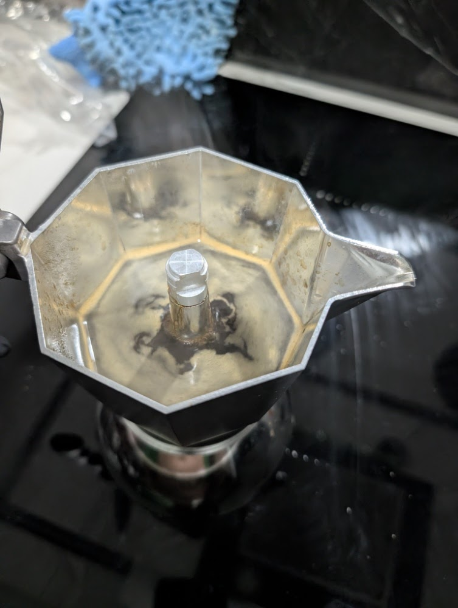

# ☕ Brikka: Geisha Huatusco - Protocolo de Especialidad (v5.1)

## ☕ Ficha técnica
- **Método**: Brikka Induction (4 tazas)
- **Ratio**: 1:5.3
- **Café**: 28g (Geisha Huatusco - Tueste Medio)
- **Agua**: 150ml
- **Molienda**: Media-fina / Nivel 17 en DF54
- **Temperatura**: Agua precalentada (~75°C)

## 🛠️ Equipamiento adicional
- [x] Báscula de precisión
- [x] Cronómetro
- [x] Molino DF54 (Flat Burrs)
- [x] Trapo grueso (para cierre de base caliente)

## 📝 Procedimiento
1. **Precalentamiento**: Calentar 150ml de agua filtrada por separado hasta alcanzar aproximadamente 75°C.
2. **Molienda**: Pesar 28g de Geisha y moler en el nivel 17 de la DF54 para asegurar un flujo constante y sin bloqueos.
3. **Carga**: Verter el café en el filtro cónico y nivelar con golpecitos laterales; no aplicar presión sobre la pastilla.
4. **Ensamble**: Verter el agua caliente en la base de la Brikka y enroscar el recolector superior inmediatamente usando el trapo para lograr un sello hermético.
5. **Inducción**: Colocar sobre la estufa en Nivel 8.
6. **Extracción**: Al observar la salida del café (que debe ser laminar y sin turbulencia), mantener la potencia hasta escuchar el siseo final.
7. **Corte**: Retirar de la placa en cuanto el siseo sea constante para evitar el sabor a quemado.

## 📸 Bitácora de Imágenes
- **Extracción Validada**:

- **Color Final**: Avellanado brillante

## 💡 Notas y consejos
- *El nivel 17 es crítico para este grano; niveles más bajos (11-14) provocan extracciones violentas y amargas.*
- *El agua precalentada protege las notas volátiles del Geisha al reducir el tiempo de exposición al calor seco de la inducción.*
- *Si el volumen final es menor a 120ml, se recomienda verificar que no existan fugas de vapor en la rosca.*