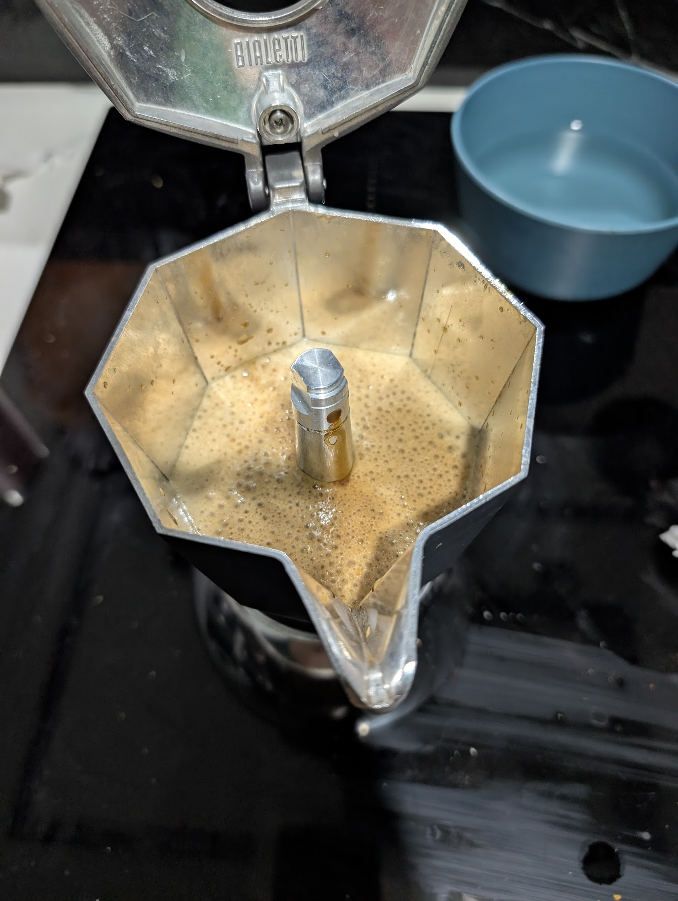

# ☕ Brikka Induction: Protocolo de Flujo Continuo (v3)

**Estado:** 🟠 En prueba (Próximo intento: 06-03-2026)
**Objetivo:** Corregir el flujo violento ("escupitajo") y la sobre-extracción oscura observada en el nivel 16 de la DF54.

---

## ☕ Ficha técnica
- **Método**: Brikka Induction (4 tazas)
- **Ratio**: 1:5.3 (Concentrado tipo espresso)
- **Café**: 28g (Geisha Huatusco - Tueste Medio)
- **Agua**: 150ml (Filtrada / Temp. ambiente)
- **Molienda**: Fina / **Nivel 19** en DF54 (ajuste micrométrico)
- **Temperatura**: Inicio con agua natural; extracción controlada por inducción

## 🛠️ Equipamiento adicional
- [x] **Molino**: DF54 (Flat Burrs)
- [x] **Báscula**: Precisión 0.1g
- [x] **Cronómetro**: Para monitoreo de fase de pre-calentamiento
- [x] **Accesorios**: Vaso dosificador de plástico (con RDT) y tazas pre-calentadas

## 📝 Procedimiento
1. **RDT (Ross Droplet Technique)**: Aplicar una gota mínima de agua a los 28g de grano antes de moler para eliminar la estática en el vaso de plástico.
2. **Molienda y Carga**: Moler en nivel 19. Verter en el filtro cónico poco a poco, dando golpes laterales para asentar el café por gravedad. **No compactar**.
3. **Limpieza de Bordes**: Asegurar que no quede ni un grano de café en la rosca o la junta de goma para garantizar un sello 100% hermético.
4. **Cierre de Seguridad**: Enroscar con fuerza máxima manual sujetando el cuerpo metálico (evitar hacer palanca con el mango de plástico).
5. **Gestión de Calor**: 
    - Iniciar en **Nivel 8** de inducción.
    - Al primer siseo o rastro de café, bajar inmediatamente a **Nivel 5**.
6. **Corte y Servicio**: Retirar de la placa al primer cambio de sonido (fase de vapor/burbujeo). Servir de inmediato a 45° en tazas calientes para intentar preservar la crema volátil.

---

## 📓 Bitácora de Cambios
- **v1 (Nivel 21)**: Sabor balanceado pero sin espuma (molienda muy gruesa).
- **v2 (Nivel 16)**: Flujo violento, café muy oscuro y amargo (sobre-extracción térmica).
- **v3 (Nivel 19)**: Ajuste actual para buscar equilibrio entre presión y claridad.

## 📸 Bitácora de Imágenes
- v 2- error

## 💡 Notas y consejos
- La Brikka es famosa por su "crema". Si no sale, prueba con un café más fresco o una molienda un poco más fina.
- No dejes la cafetera en el fuego después de que salga el café.
