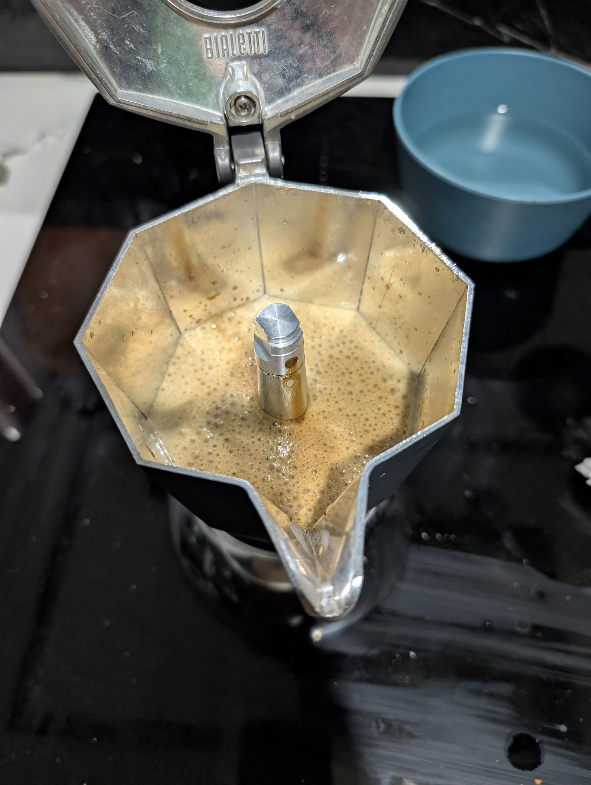

# ☕ Brikka Induction 4 tazas: Geisha Huatusco - Protocolo de Flujo Continuo

**Estado:** 🟠 En prueba (Próximo intento: 06-03-2026)

## ☕ Ficha técnica
- **Método**: Brikka Induction (4 tazas)
- **Ratio**: 1:5.3 (Concentrado tipo espresso)
- **Café**: 28g (Geisha Huatusco - Tueste Medio)
- **Agua**: 150ml (Filtrada / Temp. ambiente)
- **Molienda**: Fina / **Nivel 19** en DF54
- **Temperatura**: Inicio con agua natural; extracción controlada por inducción
- **Inducción**: **Nivel 8 en Supra**

## 🛠️ Equipamiento adicional
- [x] Molino DF54 (Flat Burrs)
- [x] Báscula (Precisión 0.1g)
- [x] Cronómetro (Para monitoreo de fase de pre-calentamiento)
- [x] Vaso dosificador de plástico (con RDT) y tazas precalentadas

## 📝 Procedimiento
1. **RDT (Ross Droplet Technique)**: Aplicar una gota mínima de agua a los 28g de grano antes de moler para eliminar la estática en el vaso de plástico.
2. **Molienda y Carga**: Moler en **Nivel 19**. Verter en el filtro cónico poco a poco, dando golpes laterales para asentar el café por gravedad. **No compactar**.
3. **Limpieza de Bordes**: Asegurar que no quede ni un grano de café en la rosca o la junta de goma para garantizar un sello 100% hermético.
4. **Cierre de Seguridad**: Enroscar con fuerza máxima manual sujetando el cuerpo metálico (evitar hacer palanca con el mango de plástico).
5. **Extracción**:
    - Iniciar en **Nivel 8 en Supra**.
    - Al primer siseo o rastro de café, bajar inmediatamente a **Nivel 5 en Supra**.
6. **Corte y Servicio**: Retirar de la placa al primer cambio de sonido (fase de vapor/burbujeo). Servir de inmediato a 45° en tazas calientes para intentar preservar la crema volátil.

## 📸 Bitácora de Imágenes

## 💡 Notas y consejos
- *La Brikka es famosa por su "crema". Si no sale, prueba con un café más fresco o una molienda un poco más fina.*
- *No dejes la cafetera en el fuego después de que salga el café.*
- *Historial de ajustes: v1 (Nivel 21) → sabor balanceado pero sin espuma; v2 (Nivel 16) → flujo violento y amargor; v3 (Nivel 19) → ajuste actual.*
