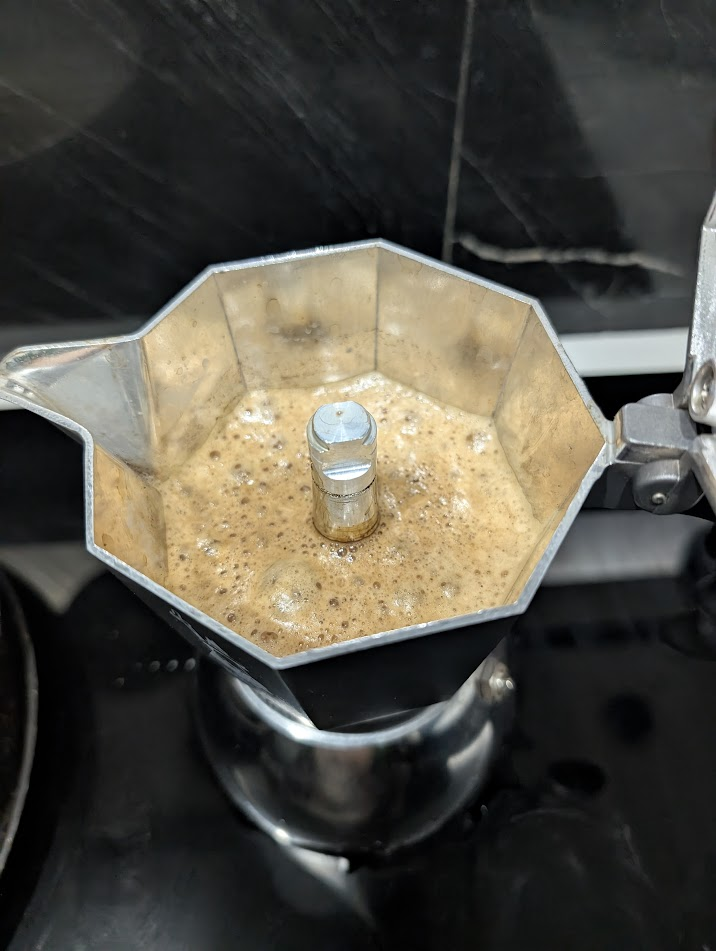

# ☕ Brikka: Kirkland Tostado Medio - Daily Driver (v1.5 FINAL)

## ☕ Ficha técnica
- **Método**: Brikka Induction (4 tazas)
- **Ratio**: ~1:6 (Concentrado Daily)
- **Café**: **25g** (Kirkland Tostado Medio) ⚠️ *Dosis validada para evitar desborde.*
- **Agua**: **150ml** (Nivel estándar, precalentada a 140°F/60°C)
- **Molienda**: Media-fina / **Nivel 22** en DF54
- **Inducción**: **Nivel 7**

## 📝 Procedimiento
1. **Molienda (RDT obligatorio)**: 25g en Nivel 22.
2. **Carga**: Nivelar con golpecitos, no compactar. La canasta debe verse llena pero no saturada.
3. **Extracción**: Nivel 7 de inducción. Cortar en cuanto la crema de la foto llene la cámara superior.

## 📸 Bitácora de Imágenes
- **Extracción Validada**:

- **Color Final**: Avellanado brillante

## 💡 Notas y consejos
- *Esta receta con 25g/Nivel 22 ha sido validada visualmente (image_10.png), logrando la crema ideal sin activar la válvula de seguridad.*
- *Si la crema sale muy rápido y es clara (aguada), baja a **Nivel 20**.*
- *Si la cafetera tarda mucho en extraer y el café sabe amargo (quemado), sube a **Nivel 24**.*