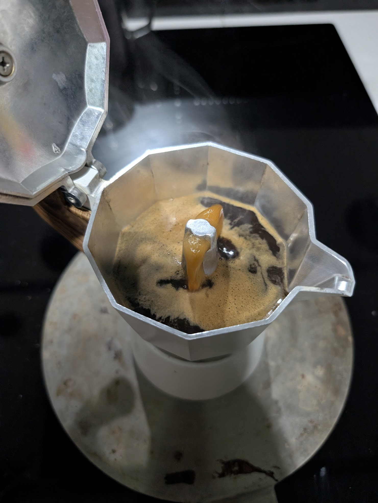

# ☕ Moka 3 Tazas: Kirkland - Adaptador Inducción (STABLE)

## ☕ Ficha técnica
- **Método**: Moka Pot Tradicional (3 tazas) + Adaptador de Inducción
- **Ratio**: 1:10 (Aproximado)
- **Café**: **15g** (Kirkland Tostado Medio) ⚠️ *Dosis ajustada por baja densidad del grano*
- **Agua**: **150ml** (Hasta el centro de la válvula)
- **Molienda**: Fina-Media / **Nivel 23** en DF54 (Calibrado con Zero-Point Real) ✅
- **Temperatura**: **Agua Hirviendo** (205°F / 96°C)

## 🛠️ Equipamiento adicional
- [x] Adaptador para inducción (Disco de interfaz)
- [x] Báscula con precisión de 0.1g
- [x] Cronómetro
- [x] Recipiente con agua fría para choque térmico final

## 📝 Procedimiento
1. **Precalentamiento**: Llenar la base de la moka con los 150ml de agua hirviendo. No usar agua fría para evitar el "horneado" del grano seco por el lag del adaptador.
2. **Carga**: Colocar los 15g de café molido en el embudo. Nivelar con ligeros golpes laterales para distribuir; **prohibido compactar**.
3. **Ensamblaje**: Enroscar la parte superior con fuerza (usar un trapo para protegerse del calor de la base).
4. **Gestión Térmica**: Colocar sobre el adaptador. Encender inducción en **Nivel 9** para vencer la inercia térmica

## 📸 Bitácora de Imágenes
- **Extracción Validada**:

- **Color Final**: Avellanado brillante